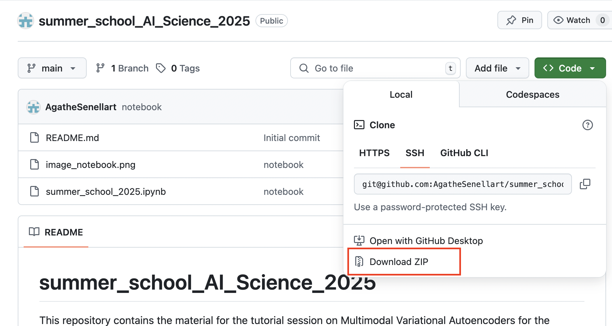

# Multimodal VAEs tutorial 
This repository contains the material for the tutorial session on Multimodal Variational Autoencoders for the Summer School AI+Science 2025.

For this tutorial, you can either: 
1. Run the notebook in a local environment on your computer. See instructions [here](#running-the-tutorial-on-your-computer).
2. Run the notebook on Google Colab : [](https://colab.research.google.com/github/AgatheSenellart/summer_school_AI_Science_2025/blob/main/summer_school_2025.ipynb)                                                                                                                        

## Running the tutorial on your computer

1. Download the code from github:


2. Uncompress the folder and move into it.

3. Into a python environment with python 3.11 run:
```pip install multivae```

4. Select this environment for running the notebook.

## After the session

The complete solution notebook will be uploaded on this page as well as the slides.


- **To know more about the different multimodal VAEs methods** that exists, you can look at this [survey paper](https://arxiv.org/abs/2207.02127). Short descriptions of models are also available in MultiVae's [documentation](https://multivae.readthedocs.io/en/latest/models/multivae.models.html).

- **Which model should I use in my application ?** : This [benchmark case study](https://github.com/AgatheSenellart/MultiVae/blob/main/examples/case_studies/benchmarking_on_partial_polymnist/results.md) can help you decide. Note that many models can be trained on **incomplete datasets** including the ones used in this tutorial.

- **What are the medical applications of multimodal VAEs ?** : These models can be used to generate synthetic medical images as done in [(Reuben et al, 2025)](https://arxiv.org/abs/2309.08747), to augment or complete a dataset, or for **anomaly detection** as done in [(Aguila et al 2023)](https://arxiv.org/abs/2303.12706) and [(Kumar et al, 2024)](https://www.biorxiv.org/content/10.1101/2024.12.12.628273v1.full.pdf).


If you have any question or feed-back, don't hesitate to reach out to agathe.senellart@inria.fr !


